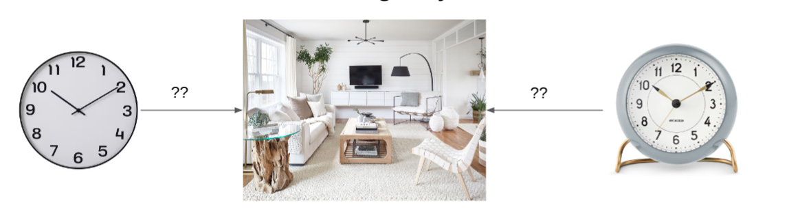
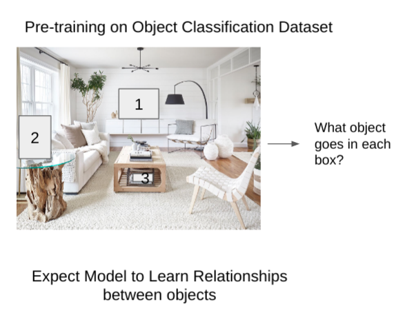

# Detection by Learning to Predict!*

This repository contains our code used in our VLR project, Spring 2022.
Please take a look at our accompanying report :
https://sites.google.com/andrew.cmu.edu/vlr-ldlp/

## Promoting Object Inter-relationship Understanding


Given the above two objects to a human would be able to reason that the wall clock would probably go on the wall whereas the table clock would go on a flat surface like the counter or coffee table.

This problem can be thought of in two ways:
1. Given an object to search for what are the most likely places to start looking
2. Given a new object, what is the most reasonable location to place it in the scene

## Our Pretraining Task

We used the COCO dataset and whiteout the bounding boxes for one object at a time then make the model predict the class that goes into the whited out box.


### To perform the pre-training task
run 
```train_baseline_classifier.py``` after updating dataset paths.

### Testing this network and logging outputs on wandb

Uncomment the last line in the `train_baseline_classifier.py` file, and comment out the second last line. 

## Effect of Pretraining task on Object Detection

Kindly visit our website above for details for the object detection performance on RetinaNet and UP-DETR.

### To Train, Test, and Visualize retinanet and updetr, please look at their corresponding readmes.


*This project was done toward completion of the course Visual Learning and Recognition (16-824) in Sprint 2022 at Carnegie Mellon University